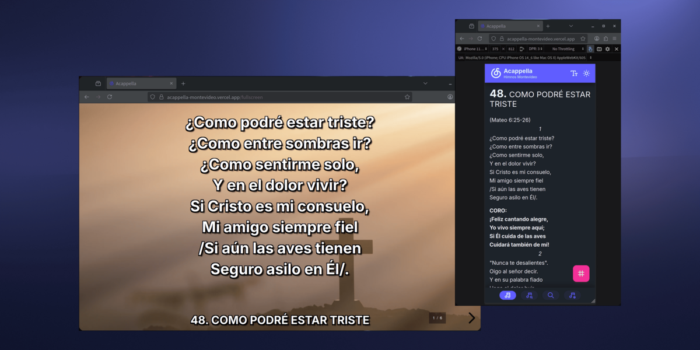

<div align="center">

# ACAPPELLA



## Himnario Digital para la alabanza

Una aplicación web progresiva para gestionar y presentar himnos y cánticos espirituales desde cualquier dispositivo.

</div>

---

## ✨ Características Principales

- 📱 **Modo Dual Inteligente**:
  - **Vista Móvil**: Navegación y lectura optimizada para dispositivos móviles
  - **Vista Desktop**: Modo de presentación profesional al estilo FreeShow, ideal para proyectar en servicios de adoración
  - Una sola aplicación, dos experiencias perfectamente adaptadas a cada contexto

- 🎯 **Búsqueda Inteligente**: Encuentra himnos por número, título o contenido de forma instantánea

- 🌙 **Modo Oscuro/Claro**: Interfaz adaptable para cualquier condición de iluminación

- 📖 **Pantalla Completa**: Modo de presentación sin distracciones para servicios de adoración

- ⚡ **Progressive Web App (PWA)**: Instala la aplicación en cualquier dispositivo

- 🎨 **Personalización de Fuentes**: Ajusta el tamaño y estilo de texto según tus preferencias

- ⭐ **Favoritos**: Marca y accede rápidamente a tus himnos más usados

- 🔄 **Sincronización Local**: Tus preferencias se guardan automáticamente en tu dispositivo

## 🎁 Código Abierto y Gratuito

Este proyecto es completamente **gratuito y de código abierto**. Cualquier persona puede:

- ✅ Clonar o hacer copia de este repositorio
- ✅ Personalizar el himnario con sus propios cantos
- ✅ Adaptar la interfaz a sus necesidades
- ✅ Desplegar su propia versión en cualquier plataforma como [Vercel](https://vercel.com) gratuitamente
- ✅ Usar la aplicación sin restricciones

## 🚀 Despliega Tu Propia Versión

### 1. Personaliza el Himnario

El himnario se encuentra en `public/songs/songbook.txt`. Cada himno sigue esta estructura:

```
5.A JESUCRISTO VEN SIN TARDAR
(Juan 4:29-30)

A Jesucristo ven sin tardar,
Que entre nosotros hoy él está,
Y te convida con dulce afán,
Tierno diciendo: "Ven".

CORO:
¡Oh, cuán grata es nuestra reunión,
Cuando allá, Señor, en tu mansión
¡Contigo estemos en comunión,
Gozando eterno bien!

Piensa que él sólo puede colmar
Tu triste pecho de gozo y paz;
Y porque anhela tu bienestar,
vuelve a decirte: "Ven".

Su voz escucha sin vacilar,
Y grato acepta lo que hoy, te da.
Tal vez mañana no habrá lugar.
No te detengas; ven.
```

**Formato:**

- Primera línea: `NÚMERO.TÍTULO DEL HIMNO`
- Segunda línea (opcional): Referencia bíblica entre paréntesis
- Línea en blanco
- Contenido del himno (estrofas, coros, etc.)
- Línea en blanco entre himnos

### 2. Despliega en Vercel

#### Opción A: Copia del Repositorio

1. Haz copia de este repositorio en GitHub
2. Modifica el archivo `public/songs/songbook.txt` con tus himnos
3. Ve a [Vercel](https://vercel.com) e inicia sesión con GitHub
4. Haz clic en "New Project"
5. Importa tu copia de ACAPPELLA
6. Haz clic en "Deploy"
7. ¡Listo! Tu himnario estará disponible en una URL pública

#### Opción B: Clonación Local

```bash
# Clona el repositorio
git clone https://github.com/ariel-aguado/acappella.git
cd acappella

# Instala las dependencias
pnpm install

# Modifica el himnario
# Edita: public/songs/songbook.txt

# Prueba localmente
pnpm dev

# Despliega en Vercel
npx vercel
```

## 🛠️ Desarrollo Local

### Requisitos Previos

- Node.js 22 o superior
- pnpm

### Instalación

```bash
# Instala las dependencias
pnpm install
```

### Servidor de Desarrollo

Inicia el servidor de desarrollo en `http://localhost:3000`:

```bash
pnpm dev
```

### Producción

Compila la aplicación para producción:

```bash
pnpm build
```

Previsualiza la compilación de producción:

```bash
pnpm preview
```

## 💡 Inspiración

Esta aplicación está inspirada en [**Aleluya**](https://play.google.com/store/apps/details?id=com.diguits.hallelujah&hl=es_419), una excelente aplicación móvil para himnarios de la Iglesia de Cristo disponible en Google Play Store.

## 📄 Licencia

Este proyecto está licenciado bajo la [Licencia MIT](LICENSE) - siéntete libre de usar, modificar y distribuir este software como desees.

## 💝 Apoya el Proyecto

Si esta aplicación te ha sido útil y deseas apoyar su desarrollo continuo, puedes hacer una donación.

Tu apoyo ayuda a mantener este proyecto activo y a desarrollar nuevas características que beneficien a toda la comunidad. ¡Cualquier contribución, por pequeña que sea, es muy apreciada!

## 🤝 Contribuciones

Las contribuciones son bienvenidas. Si deseas mejorar esta aplicación:

1. Haz copia del proyecto
2. Crea una rama para tu característica (`git checkout -b feature/NuevaCaracteristica`)
3. Haz commit de tus cambios (`git commit -m 'Agregar nueva característica'`)
4. Haz push a la rama (`git push origin feature/NuevaCaracteristica`)
5. Abre un Pull Request

## 📧 Contacto

[Ariel Aguado Albear](mailto:ariel.841207@gmail.com)

---

<div align="center">

**Hecho con ❤️ en especial para la comunidad de la Iglesia de Cristo**

</div>
